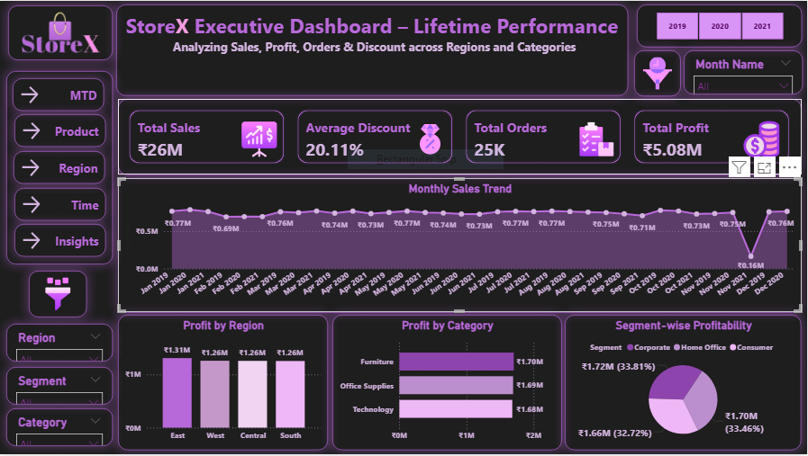
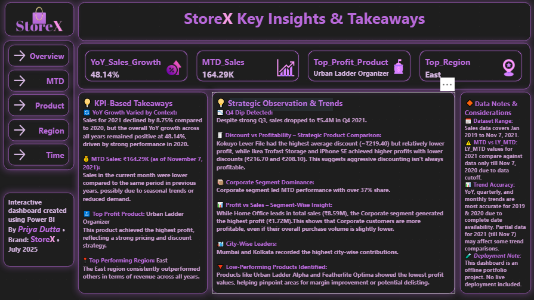

# 📊 StoreX Sales Insights Dashboard

An interactive Power BI dashboard designed to analyze key sales, profit, discount, and customer metrics for a fictional retail brand — **StoreX**. This project showcases dynamic business insights across time, categories, regions, and customers with a visually appealing, analyst-grade report layout.

> 🎨 Special focus was given to dashboard aesthetics and storytelling — carefully styled with theme consistency, visual balance, and design creativity to make every page impactful.

---

## 🔍 Project Objective

To create a visually impactful and insight-rich dashboard that helps business stakeholders quickly understand:

- Sales performance across years and quarters  
- MTD (Month-to-Date) performance  
- High-performing and low-performing products  
- Discount vs profitability trade-offs  
- Regional and customer-level contribution analysis  
- Actionable KPI-based insights and takeaways  

---

## 📊 Dataset Info

**Filename:** `Enhanced_Superstore_Sales_PriyaDutta.xlsx`  
**Coverage Period:** January 2019 – November 7, 2021  
**Size:** 25,000+ rows

Includes structured retail order data with:
- 💰 Sales, Profit, Discount, Quantity
- 📦 Order Details ( ID, Date)  
- 🧍 Customer Details (Name, Segment)  
- 🗺️ Location Data (Region, City, State)  
- 🗃️ Product Hierarchy (Category, Sub-Category)
- 🚢 Ship Mode
  
---

## 📁 Project Folder Structure

- `Storex Banner.png` – Dashboard banner image  
- `README_StoreX_PriyaDutta.md` – Project documentation  
- `Storex_Sales_Insights_Dashboard_PriyaDutta.pbix` – Power BI source file  
- `Storex_Sales_Insights_Dashboard_PriyaDutta.pdf` – Exported dashboard in PDF format  
- `Dataset/Enhanced_Superstore_Sales_PriyaDutta.xlsx` – Source dataset  
- `Images/Dashboard_Executive_Overview.png` – Executive overview screenshot  
- `Images/Dashboard_Insights.png` – Insights page screenshot  

## ⚒ Tools Used

- **Power BI**: For data modeling, DAX calculations, and dashboard development  
- **Power Query**: For data transformation and calendar table creation  

---

## 📌 Key Features

- 💡 **Executive Overview Page**: Summary KPIs and top-level performance metrics  
- 📅 **MTD Insights**: Real-time Month-to-Date analysis of Sales, Profit, Orders  
- 📦 **Product & Category Analysis**:  
  - Top/Bottom 5 product insights  
  - Profitability vs Discount analysis (scatter plot)  
  - KPI cards showing top sellers  
- 🌍 **Regional & Customer Insights**:  
  - Sales by Region, City, Customer  
  - Segment-wise profit and sales contribution  
  - Total customers and top region highlights  
- ⏱ **Time-Based Trend Analysis**:  
  - Year-over-year and quarterly growth  
  - Monthly trendline chart  
- 📋 **Insights & Takeaways**:  
  - Business observations  
  - Data coverage notes and assumptions
- 🎨 Designed with a **dark purple theme** for high visual appeal

### 📊 Visual Elements Used

- Bar & Column Charts  
- Line & Combo (Column + Line) Charts  
- Pie & Donut Charts  
- Heatmap (by City/Region)  
- Scatter Plot (for Discount vs Profit)  
- KPI Cards & Text Boxes

---

## 📊 Sample Visuals

*StoreX Executive Overview - Lifetime KPIs, Filters & Branding*

*Insight Summary - Key Oberservations, Trends, and Data Notes*

---

## 🔎 Strategic Insights Example

- YoY Growth varied: Despite a dip in 2021, overall sales showed a **+48.14% growth** driven by strong 2020 performance.  
- High discounts don't always lead to high profits: **Kokuyo Lever File** had the highest discount but lower profitability.  
- **Corporate Segment** led the MTD performance, while **Mumbai** and **Kolkata** were top cities by contribution.  

---

## ⚠️ Notes

- LY_MTD for 2021 compares only up to **Nov 7, 2020**, due to data cutoff.  
- Trends are most reliable for **2019 & 2020** where complete year data is available.  
- This is an **offline personal portfolio project** and not connected to a live system.
  
---

## 🖼️ About the Logo

The **StoreX logo** was custom-designed to complement the dashboard’s visual theme.  
- It features a **shopping bag** symbolizing retail  
- A **golden handle** for a touch of elegance  
- The letter **X** is styled in **pastel neon pink** for brand distinction

---

## 👩‍💻 Author

**Priya Dutta**  
*Aspiring Data Analyst | Power BI | SQL | Python | Excel*  
[LinkedIn Profile](https://www.linkedin.com/in/priya-dutta-b2541b14b)

---

## 📅 Date

**17th July 2025**

---
